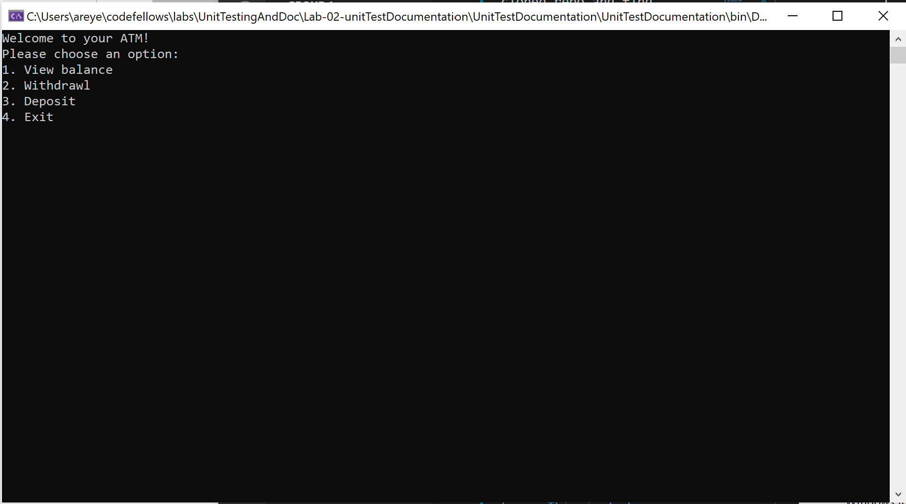
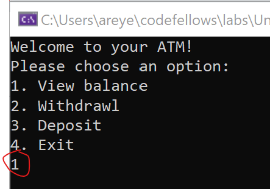
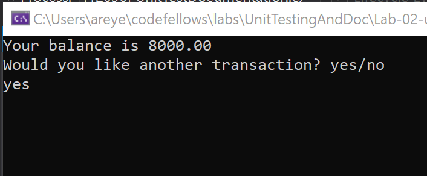
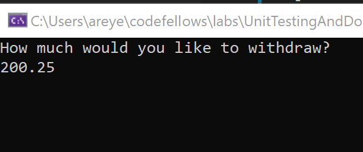
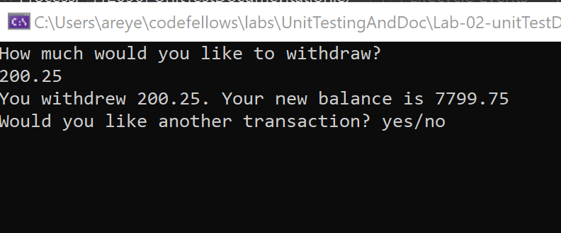
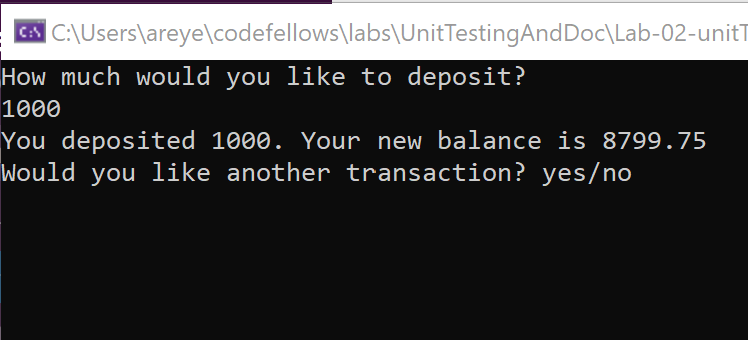
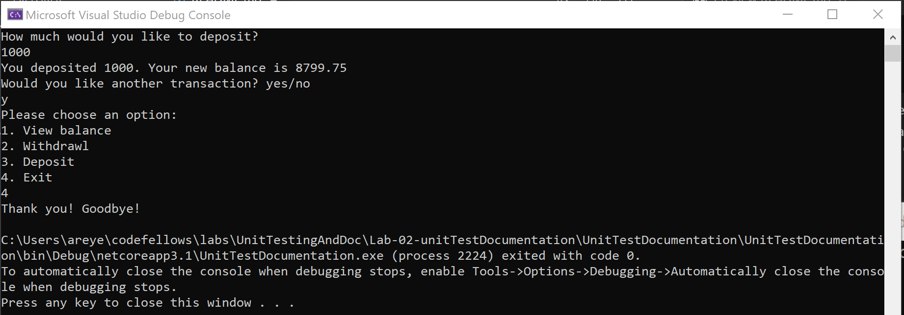

# Unit Testing and Documentation

## Console ATM!

Lab-02 Unit Testing and Documentation

*Author: Allyson Reyes*

----

## Description
This is a C# application that acts as an ATM on the console. The user is first displayed a menu with different options on where they would like to view their balance, withdraw money, deposit money, or exit the ATM. The user has a pre-set balance they can choose to add or take out money from. 

---

### Getting Started
1. Clone this repository to your local machine.

```
$ git clone [https://github.com/areyes986/Lab-02-unitTestDocumentation.git]

```
2. Then inside your terminal, make sure you are inside the folder of the cloned repo and find `program.cs`.

3. Still inside your terminal, run `dotnet run`.


---

### How to use App

#### First Look

This is the first look of the application. As you can see the user is presented with the 4 different options to either to view their balance, withdraw, deposit, or exit the ATM. 

#### Using the Application



The "1" in the red circle is the user input choosing to view their balance. It will look the same for other options as well, just with the corresponding numbers.  


As you can see here, the user can view their balance and they have the option to do another transaction if they would like. The user can either enter "yes", "no", "y", "n", as well as the inputs being uppercase.



Here we have the user wanting to withdraw $200.25 with the output as the desired withdrawl amount and their new balance. 


Same thing for deposit.
#### Application End

User can then start another transaction and enter "4" to exit and console will greet goodbye and allow user to exit.
---

### Change Log
***[The change log will list any changes made to the code base. This includes any changes from TA/Instructor feedback]***  
1.3: *Finished Readme.md* - 3/18/2020
1.2: *Added in tests for methods* - 3/18/2020
1.1: *Created the overall structure for the program.cs* - 3/17/2020 


------------------------------
